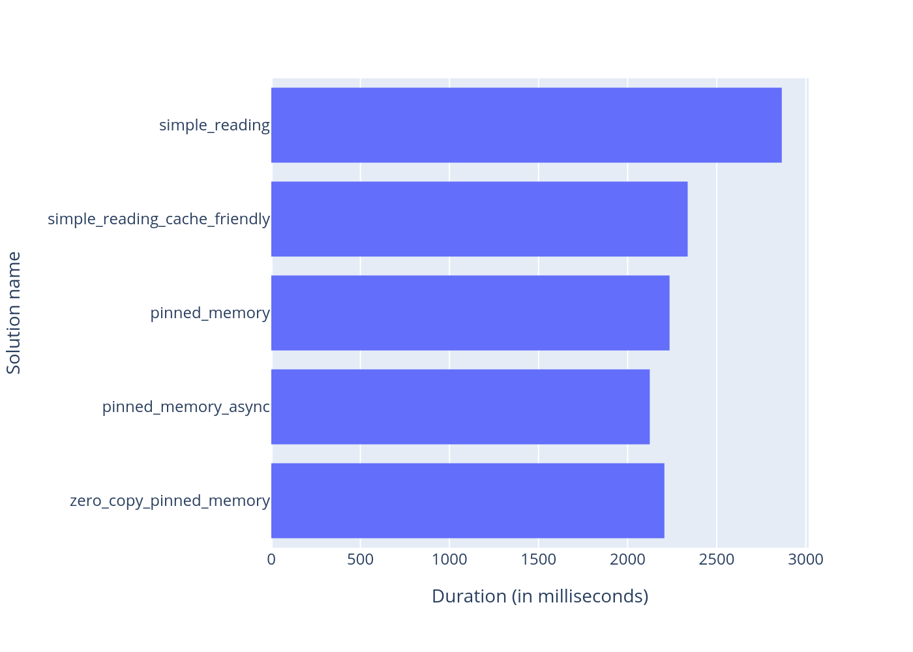
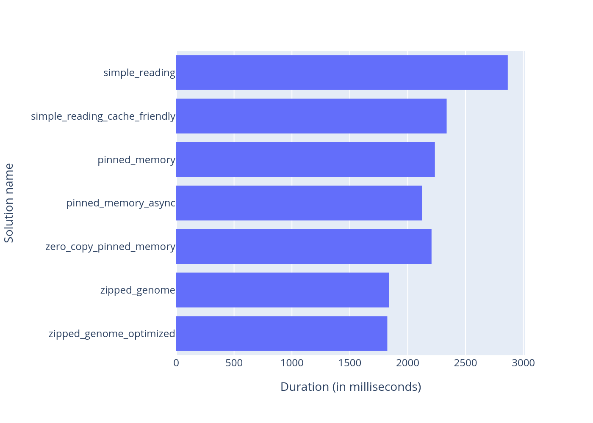
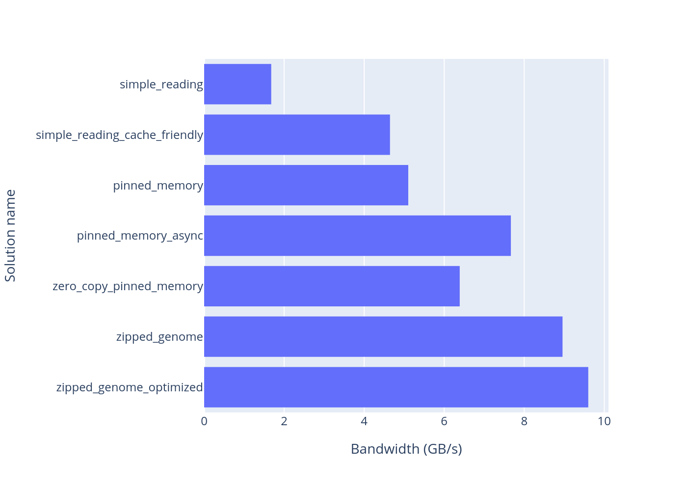

# Lightning Queen

---

This is a CUDA project that is designed to compare different approaches for reading data from SSD to GPU for future analyzing of that data.
For testing data I chose to work with genomes and all the results wil be shown for short fake 100 MB long genomes.

# Testing Data

---

For generating fake 100 MB long genomes there is small project written in `data` directory.

Usage:

```bash
cd data_generator
cmake -B build -D CMAKE_BUILD_TYPE=Release
cmake --build build
./data_generator <GENOMES_NUM> <THREADS_NUM>
```

Usage of data_generator:
```
Usage: ./data_generator <GENOMES_NUM> <THREADS_NUM>
<GENOMES_NUM> - number of genomes to generate
<THREADS_NUM> - number of threads to use for generation
```


# Results

---

> Note: The performance of analyzing 12 randomly generated genomes are tested solutions is tested on NVIDIA GeForce GTX 1650. 

Comparison of performance of different CUDA memory management algorithms.


To squeeze the performance even more, we can add additional software optimization, such as genome compressing and micro optimizations:



Comparison of GPU bandwidth (in GB per second) for each solution:




# Run solution

---

Build all solutions:

```bash
cmake -B build -D CMAKE_BUILD_TYPE=Release
cmake --build build
```

Run solution:

```bash
cd ./solutions/<SOLUTION_NAME>/ && \
../../build/solutions/<SOLUTION_NAME>/<SOLUTION_NAME> && \
cd ../..
```
For instance:

```bash
cd ./solutions/part_1_simple_reading/ && \
../../build/solutions/part_1_simple_reading/part_1_simple_reading && \
cd ../..
```

# Tests

---

Build all solutions:
```bash
cmake -B build -D CMAKE_BUILD_TYPE=Release
cmake --build build
```

Run all tests:

```bash
./build/tests/test_common_parts/test_genome_zipper/test_genome_zipper
```
